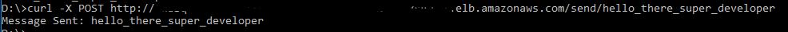
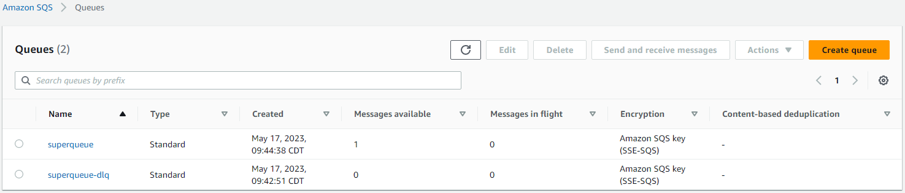
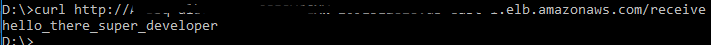

# Example of AWS SQS with JMS and Spring Boot using AWS CDK

This example uses AWS SQS with JMS.  It is deployed to AWS ECS and exposed using AWS ALB.

## Implementation Details
This example uses:
* AWS ELB and AWS ECS using AWS CDK
* Uses AWS SQS standard queue for simple messages.
* Uses Spring boot with Spring JMS to configure SQS.
* Uses AWS SQS Java extended library so that large messages can be processed.
  * this example doesn't implement large messages which you will need to implement

## Steps to run
* Run the pipeline.

## Results
If all goes well, you should see this:
* 
* 
* 
* 

### Notes
* This exaple uses JMSTemplate.  I have also used SQSConnectionfactory to send and consume messages.  If that is your requirement, uncomment those code and use them.